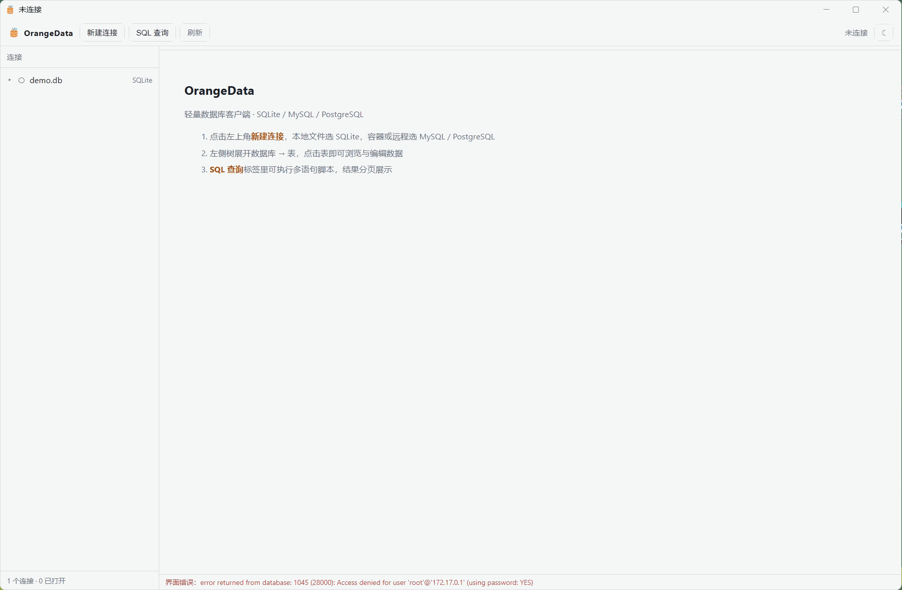
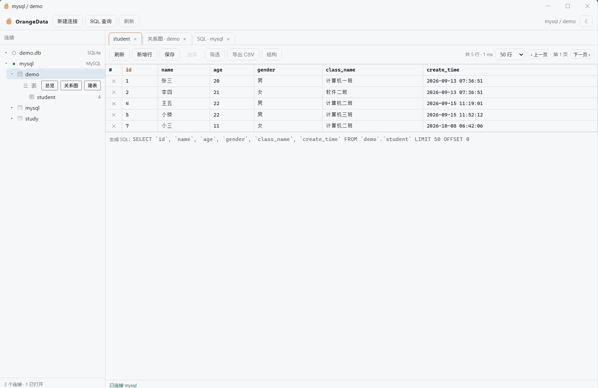

# OrangeData

A lightweight visual database client — Tauri 2 + Rust + vanilla JS, **no frontend build step**.
Speaks **SQLite / MySQL / PostgreSQL** and connects to local files, Docker containers and remote instances.

[](LICENSE)
[](https://github.com/xiaoins/OrangeData/releases)
[](https://github.com/xiaoins/OrangeData/actions/workflows/ci.yml)

中文文档：[README.zh-CN.md](README.zh-CN.md)

## Demos

**Connect and re-theme** — create a SQLite or MySQL profile, test it, expand the object tree, open the ER
diagram, then switch theme: the native titlebar recolours with the in-app palette.



**Create, read, update, delete** — run a multi-statement script (`USE` → `CREATE TABLE` → `INSERT`) with one
result tab per statement, then edit the new table in the grid: page, sort, filter, change cells, append rows,
and save the whole batch back in a single transaction.



## Download

Grab a ready-made installer from the [Releases page](https://github.com/xiaoins/OrangeData/releases):

| Platform | Artifact |
| --- | --- |
| Windows 10/11 (x64) | `*-x64-setup.exe` (NSIS, per-user install) |
| macOS (Apple Silicon / Intel) | `*_aarch64.dmg`, `*_x64.dmg` |
| Linux (x64) | `*_amd64.deb` and `*.AppImage` |

Builds are **not code-signed or notarized** yet. Expect Windows SmartScreen ("More info → Run anyway") and
macOS Gatekeeper (`xattr -dr com.apple.quarantine /Applications/OrangeData.app`) on first launch.

## Features

- **Connection manager** — profiles persisted to `connections.json`; separate local / Docker / remote shapes, with a test-connection step
- **Docker discovery** — scans running containers and reads `MYSQL_*` / `POSTGRES_*` env vars to prefill host, port, credentials and database
- **Object tree** — database → schema → table/view, with row counts and comments as badges
- **Data grid** — paging, click-to-sort, per-column filters (`=` `<>` `>` `>=` `<` `<=` `contains` `starts` `ends` `null` `notnull`), double-click to edit a cell, `∅` to set NULL, mark-delete, append row; writes go back in one transaction keyed by the primary key
- **SQL worksheet** — multi-statement scripts (stops at the first error), one result tab per statement, execution history (last 200), Ctrl+Enter to run
- **Structure panel** — columns / primary keys / foreign keys / indexes / DDL, with copy-DDL and generate-SELECT
- **Dashboard** — table, view, column and row totals plus size, with row-count and size bar charts
- **ER diagram** — SVG tables and foreign-key edges; drag a card to lay it out, drag empty canvas to pan, wheel or `−`/`+`/`Fit` to zoom, click a card to open its data
- **CSV export** — written by the Rust side; the app only asks for the dialog permission, never for filesystem access

## Tech stack

| Layer | Choice | Why |
| --- | --- | --- |
| Shell | Tauri 2 (Rust) | ~4 MB installer, no bundled Chromium |
| Drivers | sqlx 0.8 (`sqlite` / `mysql` / `postgres`) | one async driver set, no ODBC layer |
| UI | Plain HTML/CSS/JS | no bundler, no framework, no `node_modules` at runtime |
| Titlebar | `DwmSetWindowAttribute` on Windows | the native caption follows the in-app theme |

`web/` is served straight from `frontendDist`, so editing a `.js`/`.css` file only needs a rebuild of the
asset bundle — there is nothing to transpile.

## Project layout

```
src-tauri/
  src/
    main.rs            Tauri entry point, registers 26 commands
    commands.rs        IPC layer: resolve session -> switch database -> hand off to api
    model.rs           request/response types (serde camelCase)
    store.rs           connection profiles and SQL history (atomic tmp+rename writes)
    chrome.rs          DWM titlebar tinting driven by live CSS tokens
    docker.rs          docker ps / inspect parsing and credential prefill
    db/
      dialect.rs       dialect contract: every engine difference is pure string building
      dialect_sqlite.rs / mysql_dialect.rs / pg_dialect.rs
      engine.rs        Db trait (query/execute/tx) + three drivers + session registry
      api.rs           engine-agnostic browse / edit / metadata / export / graph
      values.rs        row -> JSON, probed per column type
  capabilities/        narrow permission set (core + save dialog only, no filesystem scope)
web/                   index.html + style.css + app/grid/info/sql/conn.js
assets/app-icon.png    source image for `npx tauri icon`
assets/demos/*.gif     the two recordings embedded above
```

## Development

Prerequisites: **Node 18+**, **Rust stable**, and a WebView — WebView2 on Windows (preinstalled on Win11),
`libwebkit2gtk-4.1-dev` on Linux, WebKit.framework on macOS. A C++ toolchain (MSVC on Windows) is required by
Tauri's build scripts.

```bash
npm install
npm run dev          # tauri dev, debug window
cargo check          # run inside src-tauri for a fast type check
```

### Building installers

```bash
npm run build                                  # uses bundle.targets from tauri.conf.json (nsis)
npx tauri build --bundles nsis                 # Windows
npx tauri build --bundles app,dmg              # macOS
npx tauri build --bundles deb,appimage         # Linux
```

Artifacts land in `src-tauri/target/release/bundle/<type>/`.

### Releasing

Version lives in three places — `package.json`, `src-tauri/Cargo.toml` and `src-tauri/tauri.conf.json`.
Bump all three, then:

```bash
git tag v0.2.0
git push origin v0.2.0
```

`.github/workflows/release.yml` builds all four targets, opens a draft release named after the tag and
attaches every installer to it. Mark it ready from the Releases page. `v1.2.3-beta.1` style tags are
published as pre-releases.

## Security model

Table, column and database names cannot be parameterised, so each one passes a `check_ident` allow-list
(rejects `\0`, `--`, `;`, `/*` and over-long input) and is then quoted per dialect (`` ` `` or `"`). Every
*value* is bound as a parameter; PostgreSQL additionally wraps values in `CAST(<param> AS <safe type>)`.
`LIMIT/OFFSET` are inlined as Rust integers, never as text parameters.

## Notes for mainland China networks

Direct crates.io access can be slow enough to time out. If that bites, add a registry mirror in `.cargo/config.toml`
(this path is git-ignored, so it stays local to your machine):

```toml
[source.crates-io]
replace-with = "rsproxy"

[source.rsproxy]
registry = "sparse+https://rsproxy.cn/index/"
```

On Windows + Git Bash, `PATH` entries must be POSIX-style (`/c/tools/rust/cargo/bin`), not `C:/...`;
the latter resolves to nothing and you get `rustc: command not found`. CMD and PowerShell keep the
backslash form.

## Contributing

Issues and pull requests are welcome. Please run `cargo check --all-targets` and `node --check web/*.js`
before opening a PR — that is exactly what CI does.

## License

Apache-2.0. See [LICENSE](LICENSE).
